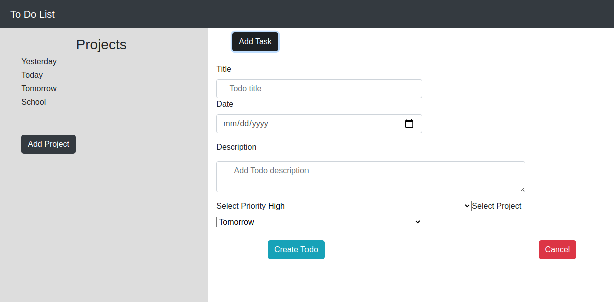

# Todo-list

A simple Todo app where a user can:
- Create Projects
- Create Todos for each project
- Edit Todos
- Remove Projects or Todos

## Built With

- JavaScript
- HTML
- CSS
- Webpack
- Bootstrap

## Live demo
Follow [this link](https://sad-minsky-6d4aa8.netlify.app/) to try the app.
## Getting Started

To set up a local copy of the project

- `git clone git@github.com:necmigunduz/to-do-list.git`
- `cd to-do-list`
- `npm install`

## Author

👤 **Necmi Gunduz**

- LinkedIn: [Necmi Gunduz](https://www.linkedin.com/in/necmigunduz/)
- Github: [@necmigunduz](https://github.com/necmigunduz/)
- Twitter: [@necmigunduz](https://twitter.com/necm_gun)
- Mail: [necmigunduz@gmail.com](necmigunduz@gmail.com)

👤 **Wandji Bertrand**

- Github: [@wandji20](https://github.com/wandji20)
- Twitter: [@wandjibertrand](https://twitter.com/wandjibertrand)
- Linkedin: [Linkedin](https://www.linkedin.com/in/wandji-bertrand/)

## 🤝 Contributing

Contributions, issues, and feature requests are welcome!

## Show your support

Give a ⭐️ if you like this project!

## Acknowledgments

- To Microverse for their `README` template.

## 📝 [License](LICENSE)